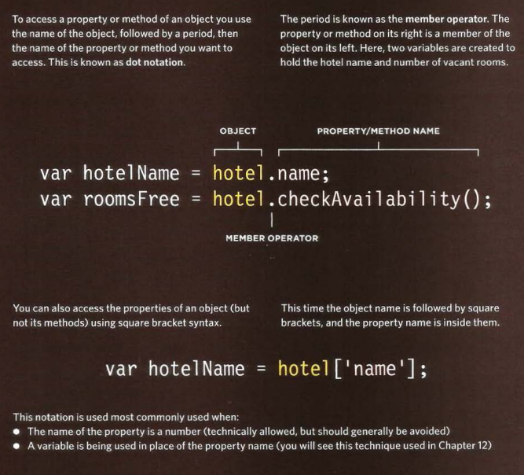
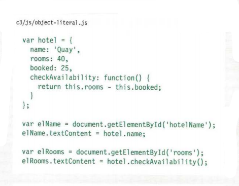
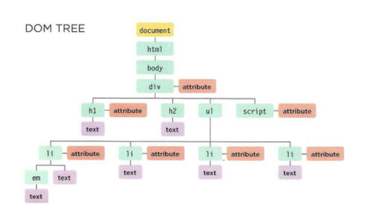
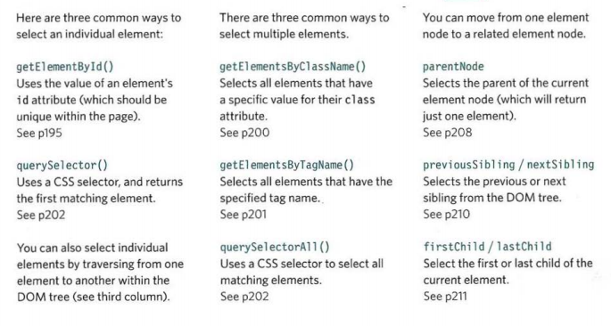
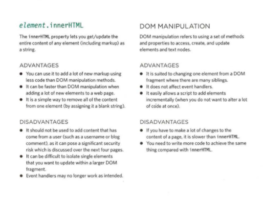

# Read: 06 - JS Object Literals; The DOM
Objects :Objects group together a set of variables and functions to create a model of a something you would recognize from the real world. In an object, variables and functions take on new names.
* IN AN OBJECT: VARIABLES BECOME KNOWN AS PROPERTIES.
* IN AN OBJECT: FUNCTIONS BECOME KNOWN AS METHODS.
 In an object,that name is called a key.An object cannot have two keys with the same name.This is because keys are used to access their corresponding values.The value of a property can be a string, number, Boolean, array, or even another object. The value of a method is always a function.

 ### Create an object 
 #### literal Natotion: 
* The object in the curly braces and their content.
* Seprate each  key and it's value by a colon,
* seprate each property and method with a comma.
#### Accessing an a object and dot natotion
you access the properties or methods of an object using dot natotion,you can also access properties using square brackets.
 
#### CREATING OBJECTS USING LITERAL NOTATION

>This example starts by creating an object using literal notation This object is called hotel which represents a hotel called Quay with 40 rooms (25 of which have been booked).
Next, the content of the page is updated with data from this object. It shows the name of the hotel by accessing the object's name property and the number of vacant rooms using the checkAvail ability() method.
To access a property of this object, the object name is followed by a dot (the period symbol) and the name of the property that you want.
>> Similarly, to use the method, you can use the object name followed by the method name.If the method needs parameters, you can supply them in the parentheses.

### Document Object Model
specifies how browsers should create a model of an HTML page and how JavaScript can access and update the contents of a web page while it is in the browser window.
The DOM is neither part of HTML, nor part of JavaScript; it is a separate set of rules.
It is implemented by all major browser makers, and covers two primary areas:
**1. MAKING A MODEL OF THE HTML PAGE**
When the browser loads a web page, it creates a model of the page in memory.
The DOM specifies the way in which the browser should structure this model using a DOM tree.
The DOM is called an object model because the model (the DOM tree) is made of objects.
Each object represents a different part of the page loaded in the browser window.
**2.ACCESSING AND CHANGING THE HTML PAGE**
The DOM also defines methods and properties to access and update each object in this model, which in turn updates what the user sees in the browser.
#### The DOM  Tree Is a Model Of a Web Page
As a browser loads a web page, it creates a model of that page. The model is called a DOM tree, and it is stored in the browsers' memory. It consists of four main types of nodes.

**ATTRIBUTE NODES**
The opening tags of HTML elements can carry attributes and these are represented by attribute nodes in the DOM tree.
**TEXT NODES**
Once you have accessed an element node, you can then reach the text within that element. This is stored in its own text node.
#### Working with the DOM tree 
Accessing and updating the DOM tree involves two steps:
1. Locate the node that represents the element you want to work with.

2. Use its text content, child elements, and attributes.
#### Caching DOM Queries
Methods that find elements in the DOM tree are called DOM queries.when you need to work with an element more than once, you shoild use a variable to store the result of this query.
#### Accessing Elements
DOM queries may return one element, or they may return a Nodelist, which is a collection of nodes.
**Groups of element nodes**
If a method can return more than one node, it will always return a Nodelist, which is a collection of nodes (even if it only finds one matching element). You then need to select the element you want from this list using an index number (which means the numbering starts at 0 like the items in an array).
**fastest route**
Finding the quickest way to access an element within your web page will make the page seem faster and/or more responsive. This usually means evaluating the minimum number of nodes on the way to the element you want to work with. 
**methods that return a single element node**
* getElementById('id')
* querySelector('css selector')
**methods that return one or more elements(as nodelist)**
* getElementByClassName('clas')
* getElementByTagName('tagName')
* guerySelectorAll('css selector')
#### methods that select individual elements
*getElementById()* and *querySelector()* can both search an entire document and return individual elements, both use a similar syntax.
#### Selecting elements using ID attributes
allows you to select a single element node by specifying the value of its id attribute.

### NODELIST: DOM Queries that return more than one element
When a DOM query returns a Nodelist, you may want to:
* Select one element from the NodeList.
* Loop through each item in the Nodelist and perform the same statements on each of the element nodes.
Like any other object, a Nodelist has properties and methods, notably:
* The l ength property tells you how many items are in the Nodelist.
* The i tern() method returns a specific node from the Nodelist when you tell it the index number of the item that you want (in the parentheses).
**Live and static nodelist** : the first one is updated as the same time you update the page, the second one the node;ist is not updated to reflect the changes made by the script.
#### Selecting an element from a nodelist
There are two ways to select an element from a Nodelist:
**The item() method** and **array syntax**.
> Both require the index number of the element you want.
* The item( method ) : You specify the index number of the element you want as a parameter of the method (inside the parentheses).
* Array Syntax : you specify the index nember of the element you want inside square brackets that follow the Nodelist. 
#### Selecting elements using class attributes 
allows you to select elements whose class attribute contains a specific value. The method has one parameter: the class name which is given in quotes within the parentheses after the method name.
#### Selecting elements by tag name
allows you to select elements using their tag name.The element name is specified as a parameter, so it is placed inside the parentheses and is contained by quote marks.
#### Selecting elements using css selectors
*querySelector()* returns the first element node that matches the CSS-style selector. *querySelectorA11()* returns a Nodelist of all of the matches.
#### Repeating actions for an entire nodelist 
when you have anodelist, you can loop through each node in the collection and apply the same statement to each.
#### Looping through a nodelist 
If you want to apply the same code to numerous elements, looping through a Nodelist is a powerful technique.  It involves finding out how many items are in the Nodelist, and then setting a counter to loop through them, one-by-one.
Each time the loop runs, the script checks that the counter is less than the total number of items in the Nodelist.
#### Traversing the DOM 
When you have an element node, you can select another element in relation to it using these five properties. This is known as traversing the DOM.(parentNode,previousSivling,nestSibling,firstChild,LastChild)
#### Whitespace nodes
Traversing the DOM can be difficult because some browsers add a text node whenever they come across whitespace between elements.
#### Access and update a text node with nodevalue
When you select a text node, you can retrieve or amend the content of it using the node Va 1 ue property.In order to use node Value, you must be on a text node, not the element that contains the text.
The text node has a property called node Value which returns the text in that text node, and it can also be used to update the content of a text node.
#### adding or removing HTML content 
there are two  fiffen=rent approaches to adding and removing content from a DOM tree.
1. **the innerHTML property** :can be used on any element node. it used to retrieve, replace and update content.
2. **DOM manipulation methods** : allows you to create element and text nodes, and then attach them to DOM tree or remove them from the DOM tree. 
#### Comparing Techniques : (updating HTML content)

#### Attribute nodes
THere are two steps to accessing and updating attributes:
1. select the element node that carries the attribute and follow ot with a period symbol. 
2. use one od the methods or properties below to word with that element's attributes.
#### Creating attributes and changingtheir values
*The className* property allows you to change the value of the class attribute. If the attribute does not exist, it will be created and given the specified value. 
*The setAttribute()* method allows you to update the value of any attribute. It takes two parameters: the attribute name, and the value for the attribute.
#### Removing attributes
To remove an attribute from an element, first select the element, then call removeAttribute () .
It has one parameter: the name of the attribute to remove.
