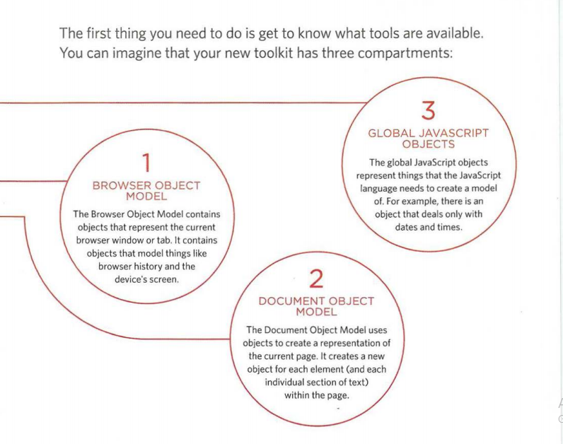
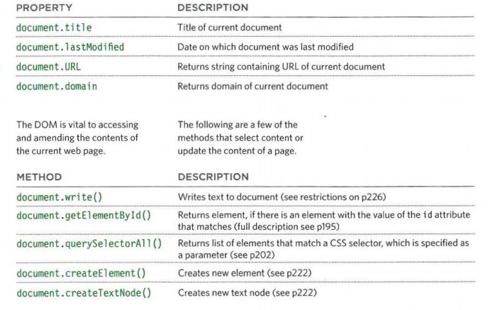
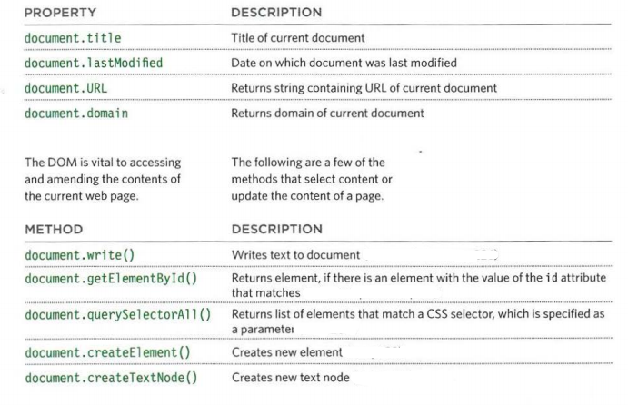
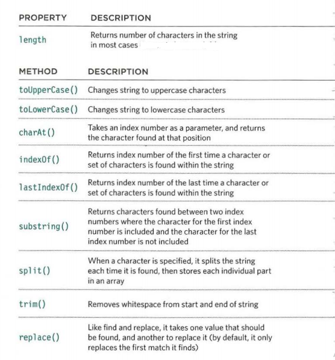
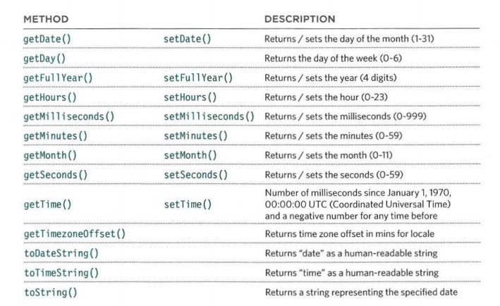

# Read: 07 - HTML Tables; JS Constructor Functions
## TABLES
A table represents information in a grid format.Examples of tables include financial reports, TV schedules, and sports results.
#### Tables Basic Structure:
* `<table>` element is used to create a table. The contents of the table are written out row by row.
* `<tr>` You indicate the start of each row using the opening `<tr>` tag.(The tr stands for table row.)
It is followed by one or more `<td>` elements (one for each cell in that row).
* `<td>` Each cell of a table is represented using a `<td>` element. (The td stands for table data.)
#### Tables Heading:
* `<th>` The `<th>` element is used just like the `<td>` element but its purpose is to represent the heading for either a column or a row. (The th stands for table heading.)
#### Spanning Column:
Sometimes you may need the entries in a table to stretch across more than one column. The colspan attribute can be used on a `<th>` or `<td>` element and indicates how many columns that cell should run across.
#### Spanning Rows:
You may also need entries in a table to stretch down across more than one row.The rowspan attribute can be
used on a `<th>` or `<td>` element to indicate how many rows a cell should span down the table.
#### Long Tables:
There are three elements that help distinguish between the main content of the table and the first and last rows (which can contain different content).These elements help people who use screen readers and also allow you to style these sections in a different manner than the rest of the table:
1. **`<thead>`**  The headings of the table should sit inside the `<thead>` element.
2. **`<tbody>`**  The body should sit inside the `<tbody>` element.
3. **`<tfoot>`**  The footer belongs inside the `<tfoot>` element.
#### Old Code:(Width & Spacing):
There are some outdated attributes which you should not use on new websites. You may, however, come across some of them when looking at older code, so I will mention them here. All of these attributes have been replaced by the use of CSS.
The width attribute was used on the opening `<table>` tag to indicate how wide that table should be and on some opening `<th>` and `<td>` tags to specify the width of individual cells. The value of this attribute is the width of the table or cell in pixels.
#### Old Code:(Border & Background):
The border attribute was used on both the `<table>` and `<td>` elements to indicate the width of the border in pixels.The bgcolor attribute was used to indicate background colors of either the entire table or individual table cells.

## OBJECTS
#### CREATING MANY OBJECTS:(CONSTRUCTOR NOTATION)
Sometimes you will want several objects to represent similar things.Object constructors can use a function as a template for creating objects.First, create the template with the object's properties and methods.The function has three parameters. Each one sets the value of a property in the object. The methods will be the same for each object created using this function To update the value of properties, use dot notation or squre brakets.
To delete a property, use the delete keyword.
#### ADDING AND REMOVING PROPERTIES:
Once you have created an object (using literal or constructor notation), you can add new properties to it.
To delelte a property, use the keyword delete. and then use dot notation to identify the property or method you want to remove.
#### THIS:
The keyword this is commonly used inside functions and objects.Where the function is declared alters what this means. It always refers to one object, usually the object in which the function operates.
#### ARRAYS ARE OBJECTS:
Arrays are actually a special type of objects. THe hold a related of key/value pairs(like all objects), but the key for each value is its index number.
#### ARRAYS OF OBJECTS AND OBJECTS IN ARRAYS:
**Arrays in an object**
the porperty of any object can hold an array.
**objectsin an array**
the value of any element in an array can be an object.
#### BUILT-IN OBJECTS:
to represent things like the browser window and the current web page shown in that window.These built-in objects act like a toolkit for creating interactive web page.

#### THREE GROUPS OF BUILT-IN OBJECTS:
**Browser object model**
it create a model of the browser tab or a window.

**Document object model**
Create a model of the current web page.

**Global JAVASCRIPT objects**
this do not form a single model.They are a group of individual objects that relate to different parts of the JavaScript language.
* These objects represent basic data types: (String,Number,Boolean).
* These objects help deal with real world concept: (Data,Math,Regex).

#### USING THE DOCUMENT OBJECT:
1. THe details about the page are collected from properties of the document object. and they are stored inside a variablecalled msg, along with HTML.
2. THe getElementById() method selects an element from the page using the value of it's id attribute.

#### GLOBAL OBJECTS:(STRING OBJECT):

#### GLOBAL OBJECTS:(NUMBER OBJECT):
| Method | Description |
|--------|-------------|
|isNaN() |Checks if the value is not a number|
|toFixed()|Rounds to specified number of decimal places (returns a string)|
|toPrecision()|Rounds to total number of places (returns a string)|
|toExponential()|Returns a string representing the number in exponential notation|

***Commonly used term***
* integer
* real nember
* gloating point number
* scientific notation

#### GLOBAL OBJECTS:(MATH OBJECT):
| Method | Description |
|--------|-------------|
|Math.round() |round number to the nearest|
|Math.sqrt(n)|returnsqure root of positive number|
|Math.ceil()|Rounds number up to the nearest integer|
|Math.floor()|Returns number down to the nearest integer|
###### Math object to create random numbers:
> To get a random number whole between the ceil number and floor number you need to multiply the randomly generated number for them.

#### GOLBAL OBJECT:(DATE AND TIME OBJECTS):
