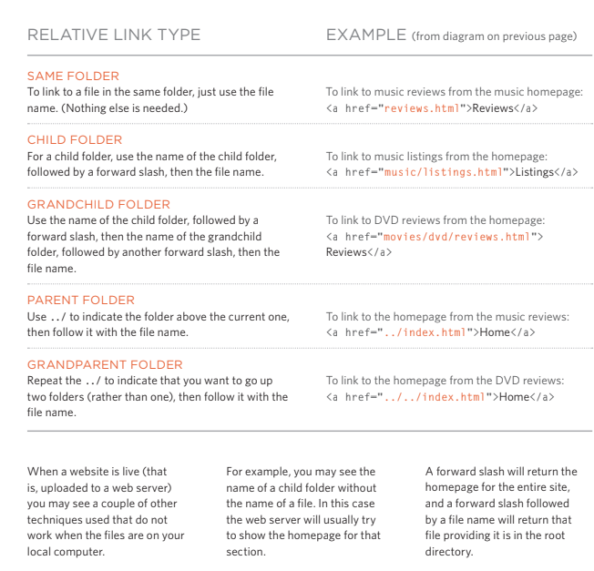

# Read: 08 - More CSS Layout

## LINKS 
#### Writing links :
Links are created using the `<a>` element. Users can click on anything between the opening `<a>` tag and the closing `</a>` tag. You specify which page you want to link to using the href attribute. 
#### linking to other sites :
* `<a>` tag : Links are created using the `<a>` 
element which has an attribute called href. The value of the href attribute is the page that you want people to go to when they click on the link.
#### Directory Structure :
On larger websites it's a good idea to organize your code by placing the pages for each different section of the site into a new folder. Folders on a website are sometimes referred to as directories.
#### Relative URLS :
Relative URLs can be used when linking to pages within your own website. They provide a shorthand way of telling the browser where to find your files.

#### Email links :
* `<mailto>` : To create a link that starts up the user's email program and addresses an email to a specified email address, you use the `<a>` element. However, this time the value of the href attribute starts with mailto: and is followed by the email address you want the email to be sent to.
#### Opening link in a window :
* `<target>` : If you want a link to open in a new window, you can use the target attribute on the opening `<a>` tag. The value of this attribute should be _blank.
### Layouts :
* Building blocks : CSS treats each HTML element as if it is in its own box .This box will be inline box(flow in between surrounding texts) or block-level box(start on a new line).
#### Containing elements :
If one block-level element sits inside another block-level element then the outer box is known as the contianing or parent element.
#### Contorlling the position of element :
CSS uses the positioning schemes to control the layout of a page, you can use the float property.
#### Parents of floated elements: problem:
 If a containing element only contains floated elements, some browsers will treat it as if it is zero pixels tall.
 #### Parents of floated elements: solution:
 Traditionally, developers got around this problem by adding an extra element after the last floated box (inside the containing element). A CSS rule would be applied to this additional element setting the clear property to have a value of both. But this meant that an extra element was added to the HTML just to fix the height of the containing element.
 #### Creating Multi-Column Layouts with Floats:
The following three CSS properties are used to position the columns next to each other: Width, float and margin.
#### Page Sizes :
Designers keep pages within 960-1000 pixels wide,
and indicate what the site is about within the top 600
pixels (to demonstrate its relevance without scrolling.
#### Layout Grids:
Grids help create professional and flexible designs. CSS Frameworks provide rules for common tasks. You can include multiple CSS files in one page.
