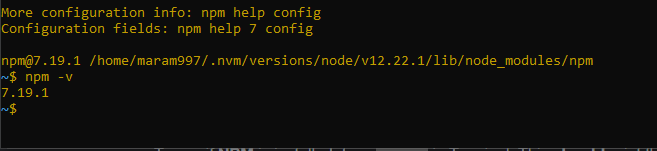

# Read: Class 06 - NODE.JS:
### What is node.js:
Node.js is designed to build scalable network applications. many connections can be handled concurrently. Upon each connection, the callback is fired, but if there is no work to be done, Node.js will sleep.
### what is Chrome’s V8 JavaScript Engine:
The V8 engine is the open-source JavaScript engine that runs in Google Chrome and other Chromium-based web browsers, including Brave, Opera, and Vivaldi. It was designed with performance in mind and is responsible for compiling JavaScript directly to native machine code that your computer can execute.
### What does it mean that node is a JavaScript runtime:
Node.js is a JavaScript runtime environment that **achieves low latency and high throughput by taking a “non-blocking” approach to serving requests.** In other words, Node.js wastes no time or resources on waiting for I/O requests to return.
### What is npm:
***npm*** is the package manager for the Node JavaScript platform. It puts modules in place so that node can find them, and manages dependency conflicts intelligently. It is extremely configurable to support a wide variety of use cases. Most commonly, it is used to publish, discover, install, and develop node programs.
### What version of node are you running on your machine:

### What version of npm are you running on your machine:

### What command would you type to install a library/package called ‘jshint’:
To install the JSHint tool, run the command npm install jshint in CLI. If you want to check if JSHint has been successfully installed, run the command jshint -version to see its version. Once this step is over, installation is complete.
### What is node used for:
1. Node. js is primarily used for non-blocking, event-driven servers, due to its single-threaded nature. 
2. It's used for traditional web sites and back-end API services, but was designed with real-time, push-based architectures in mind.

