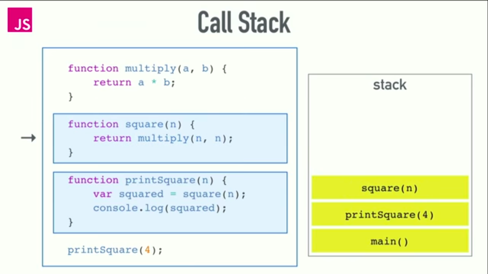

# Read : Class 10 -  In memory storage
#### **What is a ‘call’**
 With the call() method, you can write a method that can be used on different objects.

#### **How many ‘calls’ can happen at once**
 Since the call stack is single, function(s) execution, is done, one at a time, from top to bottom. It means the call stack is synchronous.

#### **What does LIFO mean** 
Last In, First Out,it means that the last function that gets pushed into the stack is the first to be pop out, when the function returns.

#### Draw an example of a call stack and the functions that would need to be invoked to generate that call stack.

#### **What causes a Stack Overflow** 
A stack overflow occurs when there is a recursive function (a function that calls itself) without an exit point. The browser (hosting environment) has a maximum stack call that it can accomodate before throwing a stack error.

## Types of error messages:
1. Reference errors
2. Syntax errors
3. Range errors
4. Type errors

> There are also warnings, for instance telling you about a deprecated method, which can be found more frequently in firefox developer tools.
