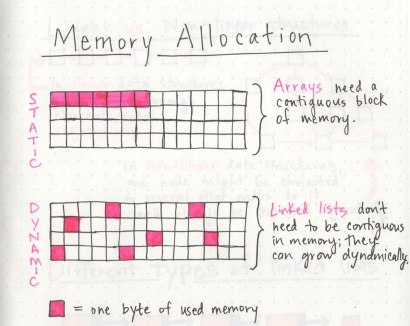

# READ 05 :  Implementation: Linked Lists
## Linked Lists
A Linked List is a sequence of Nodes that are connected/linked to each other.
## Terminology:
- Linked List : A data structure that contains nodes that links/points to the next node in the list.
- Node : Nodes are the individual items/links that live in a linked list. Each node contains the data for each link.
- Next : Each `node` contains a property called Next. This property contains the reference to the next node.
Head : The Head is a reference of type Node to the first node in a linked list.
Current : The Current is a reference of type Node to the node that is currently being looked at.
## Traversal:
You are not able to use a foreach or for loop. We depend on the Next value in each node to guide us where the next reference is pointing. 
- The best way to approach a traversal is through the use of a while() loop. This allows us to continually check that the Next node in the list is not null.
## Adding a Node : 
#### Required steps to add a new node with an O(1) efficiency:
1. We can then instantiate the new node that we are adding. The values passed in as arguments into the Add() method will define what the value of the Node will be.
2. `newNode.Next by default is set to null`. We want to set newNode.Next property to the same location that the Head node is pointing towards. Because Head is just a reference type, we will be assigning it to the same allocation in memory as the node it is pointing too. In this case, it’s Node1.
3. At this point in the program we now “technically” have newNode at the beginning of the linked list, but we are not done yet. We now have to re-assign where Head is pointing too. Since Node1 is no longer the first node in the list, we want to re-assign Head to point at newNode.
#### Adding a Node O(n) :  
> Adding a node to the middle of a linked list is a bit different than adding to the beginning. This is because we are working with more nodes and must re-allocate to make room for the new node.

1. Let’s start out with a basic Singly Linked List.
2. Now let’s create a new node (node6). We will set the value of node6 to be 16. The Next will be null because we haven’t yet attached it into the linked list.
3. Now let’s start the adding. We can do an AddBefore method or an AddAfter. For this documentation, we will do an AddBefore.
**in this case the added one is node6 , and it wil be added before node4**
1. urrent is pointing to node3.
2. node3.Next property is equal to node4.
3. Since this is the node we want to insert before, we can now set our node6.Next property also to node4. We do this at the time the node is found to prevent setting node6.Next to a node that may not exist.
4. Uh-Oh, now both node3 and node6 are pointing to the same next node. node6 is not quite fully apart of the linked list.
5. Next, we have to adjust node3.Next to point to the newly created node, node6. Since we still have Current pointing to node3 this will be a straightforward transaction. We just simply tell Current (because it is pointing to the same memory location as node3) to change it’s Next to point to the new node (node6).
## Memory management : 
> When an array is created, it needs a certain amount of memory. If we had 7 letters that we needed to store in an array, we would need 7 bytes of memory to represent that array. But, we’d need all of that memory in one contiguous block. That is to say, our computer would need to locate 7 bytes of memory that was free, one byte next to the another, all together, in one place.
>>On the other hand, when a linked list is born, it doesn’t need 7 bytes of memory all in one place. One byte could live somewhere, while the next byte could be stored in another place in memory altogether! Linked lists don’t need to take up a single block of memory; instead, the memory that they use can be scattered throughout.

* The fundamental difference between arrays and linked lists is that arrays are static data structures, while linked lists are dynamic data structures.
 > this means that even if the structure was to grow or shrink in size and elements were to be added or removed, it still always needs a given size and amount of memory.
 >> On the other hand, a dynamic data structure can shrink and grow in memory. It doesn’t need a set amount of memory to be allocated in order to exist, and its size and shape can change, and the amount of memory it needs can change as well.

 * Lists for all shapes and sizes
 1. Singly Linked List.
 2. Douply Linked List.
 3. Circular Linked List.
 

 ## What even is Big O?
Whether you’re building software as a service, choosing a front end framework, or just trying to make your code DRY and more elegant, that’s what all of us are striving towards: being efficient with our software, and choosing things that are important to what we’re building, all while being aware of the tradeoffs that we’ll ultimately have to make.
 > There are two major points to consider when thinking about how an algorithm performs: how much time it requires at runtime given how much time and memory it needs.

 

 #### There are two types of Big O equations to remember are O(1) and O(n) :
 => **An O(1) function** takes constant time, which is to say that it doesn’t matter how many elements we have, or how huge our input is: it’ll always take the same amount of time and memory to run our algorithm. 
 => **An O(n) function** is linear, which means that as our input grows (from ten numbers, to ten thousand, to ten million), the space and time that we need to run that algorithm grows linearly.

 ## Growing a linked list : 
 * Inserting an element at the beginning of a linked list is particularly nice and efficient because it takes the same amount of time, no matter how long our list is, which is to say it has a space time complexity that is constant, or O(1).
1. First, we find the head node of the linked list.
2. Next, we’ll make our new node, and set its pointer to the current first node of the list.
3. Lastly, we rearrange our head node’s pointer to point at our new node.

* But inserting an element at the end of a linked list is a different story. The interesting thing here is that the steps you take to actually do the inserting are the exact same:
1. Find the node we want to change the pointer of (in this case, the last node)
2. Create the new node we want to insert and set its pointer (in this case, to null)
3. Direct the preceding node’s pointer to our new node