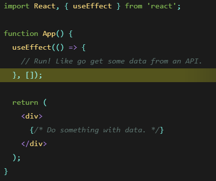

# Read: Class 29 - Advanced State with Reducers

## How can we ensure that an effect hook runs only once?

If you only want to run the function given to useEffect after the initial render, you can give it an empty array as second argument.

## Can useState() update more than one state variable at the same time?

You could combine the loading state and data state into one state object and then you could do one setState call and there will only be one render. Note: Unlike the setState in class components, the setState returned from useState doesn't merge objects with existing state, it replaces the object entirely.

## Is useState() synchronous?

setState is asynchronous. it does not update the state immediately but have queues that are used to update the state object. This is done to improve the performance of the rendering of React components. Even though they are asynchronous, the useState and setState functions do not return promises.
