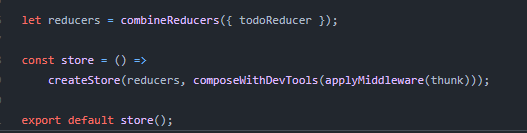

# Read: Class 39 - Redux - Additional Topics

## What’s the best practice for “pre-loading” data into the store (on application start) in a Redux application?

 The most 'redux-like' way of handling the pre-loading of data would be to fire off the asynchronous action in the lifecycle method (probably componentWillMount ) of a Higher Order Component that wraps your app.

## When using a thunk/async action that dispatches the actual action, which do you export from your reducer?

1. A state is stored centrally in a store.
2. The UI subscribes to state via the connect HOC from react-redux. It renders and re-renders, following changes in the state.
3. State changes are launched with the help of action-creators. An action creator function actually return an action-object, which has at least the type property.
4. The action-object is passed to redux's dispatch function, which eventually passes it to the reducer function, we define.
5. The reducer function composes and returns a new state, based on the received action-object.
6. The returned state is becoming new state in the store.
7. And the changes are propagated to UI parts that have subscribed to it.
8. And the story goes on

