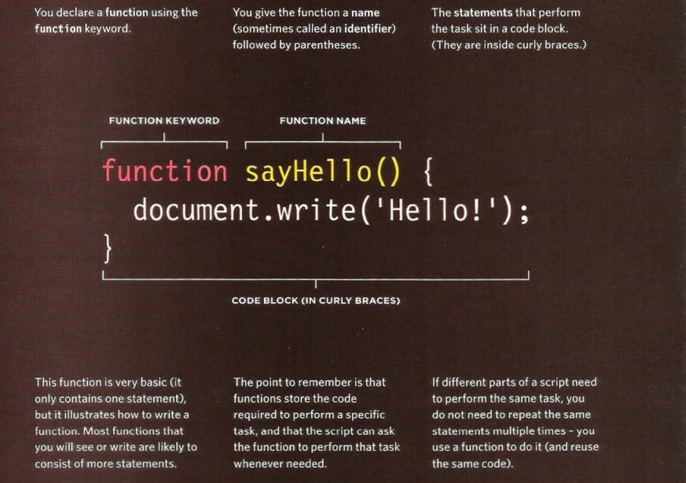
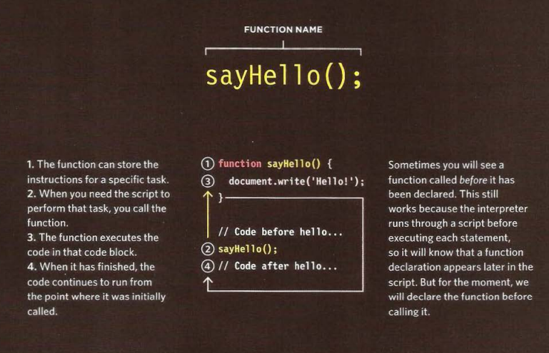
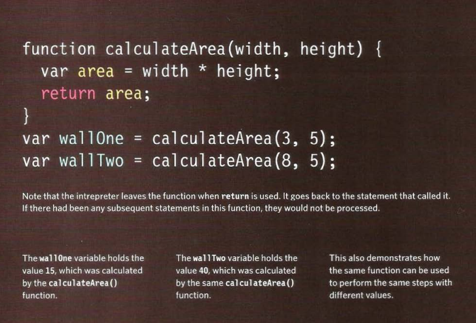

# Read: 06 - Programming with JavaScript
## WHAT IS A FUNCTION? 
let you group a series of statement together to perform a specific tasks. it different parts of script repeat the same task, you can reuse the same set of statement.
> If you are going to ask the function to perform it's tasks later, you nee to give your function a name. that's name should describe the task it is performing. when you ask it to perform  it's task, it is known as calling the function.

- Parameters : any added information passed to a  function.
- Return Value : When you write a function and you expect it to provide you with an answer, the response is known as return value.
- Declaration a function : to create a unction you give it a name and then write the statements  needed to achieve it's tasks inside the curly braces.

- Calling the function : we call the function by name, then pass in any required parameters in a comma delimited list enclosed in parenthesis.

- Declaring functions than need information :
in such cases, when you declare the function you give it parameters inside the functions. The parameters at like variables. so we indicate what it needs to know in parentheses after function name.
> When you call a function that has parameters, you specify the values it should use in the parentheses that follow it's name. These values are called arguments, and they can be provided as values or as variables.
> the return keyword is used to return a value to the code that called the function.

